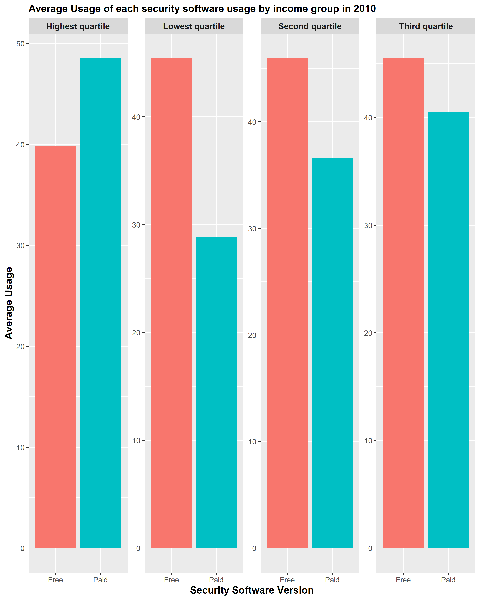
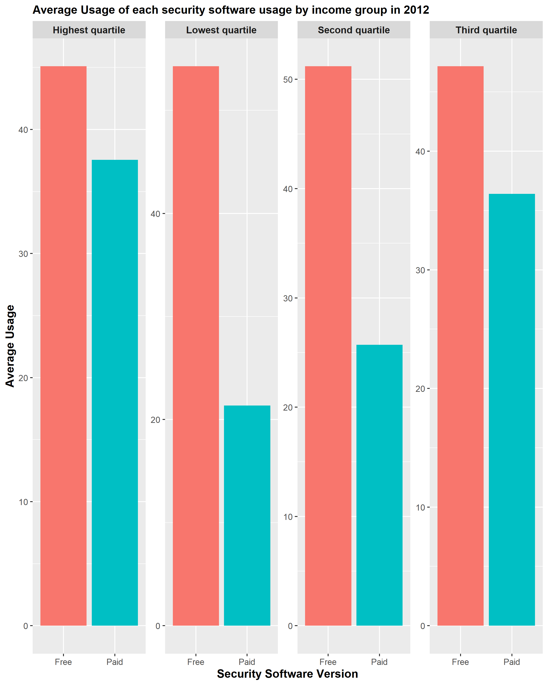

Exploratory data analysis of the security software user dataset
================

# Summary of the dataset

The data set in this project is from the Statistics Canada called
“Internet security software use, by household income, age group and
level of education,” which can be found
[here](https://open.canada.ca/data/en/dataset/6e45b085-1fbf-4ba4-881b-f4eebbb3764e).
This data set consists of the responses from the 2018 Canadian Internet
Use Survey (CIUS), which aims to collect information regarding the use
of digital technologies and the online behaviors for Canadians who are
over age 15 (2018 Canadian Internet Use Survey 2012). This field sample
consists of 45,400 units of data and this data set is a summary data set
from all survey responses. This data set has 400 observations with 18
attributes. Each observations represents a survey response with certain
attribute regarding the year of the security software usage status, the
education level, whether security software is used, income level, the
proportion of users and etc. In this project, only two features will be
used: `Security software use`, `Household income quartile`, `VALUE`. The
information regarding these features are:

-   **Security software use**:
    `Internet users that currently use security software` or
    `Internet users that currently use free versions of security software`.

-   **Household income quartile**:

    -   Highest quartile household income: $87,000 or higher for 2010
        data and $94,000 or higher for 2012 data

    -   Third quartile household income: $50,000 to $87,000 for 2010
        data and $55,000 to $94,000 for 2012 data

    -   Second quartile household income: $30,000 to $50,000 for 2010
        data and $30,000 to $55,000 for 2012 data

    -   Lowest quartile household income: less than or equal to $30,000

-   **Value**: Percentage of all individuals aged 16 years old and over
    who responded to have used the Internet for personal non business
    use in the past twelve months from any location

### Summary table

Before any explanatory data analysis, I would like to see whether there
is any differences between the percentage of users that used free
versions of security software and of those who used paid versions of
security software.

#### Summary Table for 2010

| Security Software Version                                            | Average Users Proportion |
|:---------------------------------------------------------------------|-------------------------:|
| Internet users that currently use paid versions of security software |                     41.2 |
| Internet users that currently use free versions of security software |                     43.5 |
| Internet users that currently use security software                  |                     84.7 |

Table 1. Average Proportion of Users per Security Software Version in
2010.

From the table above, the percentage of users that used security
software in 2010 was 84.7%. There is not a significant difference
between the percentage of users that used free version of security
software and of that used paid version of security software.

#### Summary Table for 2012

| Security Software Version                                            | Average Users Proportion |
|:---------------------------------------------------------------------|-------------------------:|
| Internet users that currently use paid versions of security software |                     34.7 |
| Internet users that currently use free versions of security software |                     46.8 |
| Internet users that currently use security software                  |                     81.5 |

Table 2. Average Proportion of Users per Security Software Version in
2012.

From the table above, the percentage of users that used security
software in 2010 was 81.5%. The difference between the percentage of
users that used free version of security software and of that used paid
version of security software has increased. The percentage of users that
used free versions for security software is roughly 12.1% higher than
the percentage of users who used paid versions for security software.

### Exploratory analysis on the training data set

To check whether there is a difference between the percentage of users
who used free versions of security software and of who used paid
versions of security, I plotted the bar graphs of percentage of users of
each groups for each household income quartiles. In doing this, I could
see that overall, the percentage of users who used free versions of
security software is higher than the percentage of users who used paid
versions of security software. For both 2010 and 2012, it is clear that
the percentage of users who used paid versions of security software rose
as the income level increased. The difference of the percentage of users
is different between different income levels.

Figure 1. Distribution of percentage of users for each income levels in
2010.

Figure 2. Distribution of percentage of users for each income levels in
2012.

# References

2018 Canadian Internet Use Survey. 2012. “Statistics Canada.”
<https://open.canada.ca/data/en/dataset/6e45b085-1fbf-4ba4-881b-f4eebbb3764e>.

